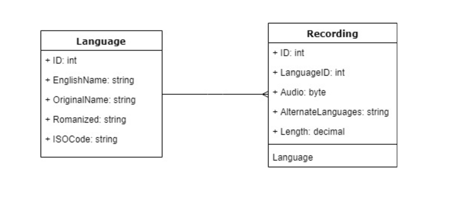

# Ling
Add description

## Planning
[Project Requirements](/Requirements.md)

## Deployed Site
https://lingrecord.azurewebsites.net/

## Usage
Our web app features a clean and easy to follow UI. Our home page shows a microphone icon and a Language Region selection dropdown. A user clicks on the microphone to start recording, and then clicks it again to stop.

After capturing a recording, the Transcribe button appears. Clicking on Transcribe will send the recording off for language analysis (the user sees a loading bar animation during the analysis).

After analysis, the results appear below the recording.

Clicking the hamburger menu in the top left corner expands the side navigation bar from which the user can navigate to the Recordings page.
The recordings page lists all captured recordings, and allows the user to browse through and play recordings.

## Database Schema

## Tools used
Visual Studio, .NET MVC CORE, Entity Framework, CSS/HTML, SQL database, Azure, Azure Blob Storage, [Google Cloud Speech API (beta)](https://cloud.google.com/speech-to-text/docs/multiple-languages), Bootstrap, [wavesurfer.js](https://wavesurfer-js.org/)

## Security/Performance Report
[Report](/Security.md)

## Contributors
* [Tre Cain](https://github.com/trecain)
* [Kendra Ellis](https://github.com/ellisken)
* [Rebecca Hong](https://github.com/rh24)
* [Gui Yazbek](https://github.com/gyazbek)

## Acknowledgements
* [CodeLabs tutorial on Google Speech API](https://codelabs.developers.google.com/codelabs/cloud-speech-intro/index.html#0)
* [Gregory Dukes from the StickerFire project](https://github.com/StickerFire/StickerFire)

## License
MIT
